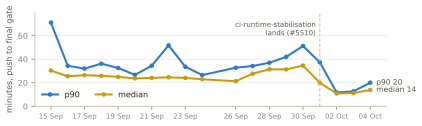
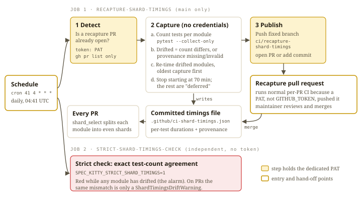
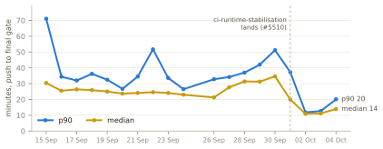
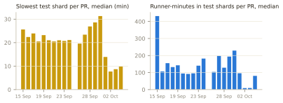
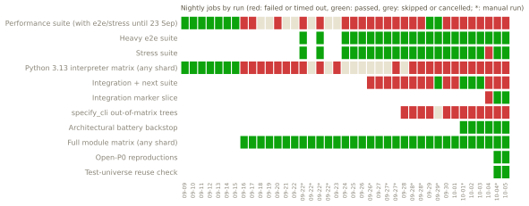
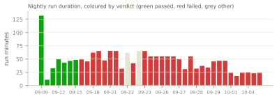
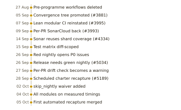

# Executive summary

**Bottom line.** Pull-request CI got much faster this week: from 2 to 4 October, a green PR that ran tests took a median **11.5 minutes** from push to final verdict, against **25.8 minutes** from 16 to 30 September. The job that keeps test timings balanced published its first automatic fix on 5 October. The nightly suite is the open problem: **it has not been green since 15 September**, and the last release candidate (v4.0.0rc5) shipped by waiving the rule that a release needs a green nightly.

| Green PRs that ran tests | 16 to 30 Sep (547 runs) | 2 to 4 Oct (119 runs) |
|---|---|---|
| Median / p90 push-to-verdict | 25.8 / 38.1 min | 11.5 / 18.9 min |
| Median slowest test shard | 22.5 min | 8.8 min |
| Median runner-minutes in test shards | 120.6 | 26.1 |



**What happened.**

1. **Per-PR CI is fixed for now.** Mission `ci-runtime-stabilisation` (#5510) landed on 1 October; the next day per-PR time halved. On 4 October every test module moved onto measured timings (#5688), and on 5 October the automatic re-timing job landed its first PR (#5730).
2. **The nightly has been red for 20 days.** Of 39 runs since 9 September, 30 failed and 2 were cancelled. The 7 green runs all came before 16 September, when the nightly had 3 jobs; it now has 57. Most reds are tests only the nightly runs, which fell behind product changes that merged green.
3. **The release gate was waived once.** The v4.0.0rc5 tag push failed at the nightly gate on 2 October; a `skip_nightly` waiver was added that morning and the release was published with the gate skipped and the waiver logged.

**Still open:** two automatic nightly P0s (#5419, #5611), flaky wall-clock tests (#5614), a check only the nightly catches (#5708), and tests no CI job runs (#5652). See *Open risks*.

**What we need from leadership.**

- Decide how much of the nightly must be green for the next release, and whether `skip_nightly` stays. Since the gate arrived on 26 September, no commit could have met it.
- Back moving nightly-only test trees into per-PR CI where they are cheap, so a red lands on the PR that caused it.
- Approve reusing the shard-recapture token for the release gate (it needs Actions write scope), or issue a separate one.

<div style="page-break-before:always"></div>

# Part A. How shard-timing capture works

## The problem it solves

Every PR runs the test suite as a matrix of **modules** (20 rows in `.github/ci-module-registry.yml`). The large modules are split into **shards** that run side by side on separate runners, so a PR's test time is roughly the time of its slowest shard. The split has to be even.

The split is computed from recorded per-test durations. `scripts/ci/shard_select.py` collects a module's tests, reads that module's durations from the committed file `.github/ci-shard-timings.json`, and deals the tests out longest-first across the module's shards. It pairs durations with tests by position. When a module's current test count no longer matches the recorded count, the selector falls back to **equal weights** and prints a warning (`shard_select.py:156-166`). The run still passes. It just gets more lopsided, and nobody is told in a way that sticks.

That is a quiet failure: tests are added every day, the recorded timings go stale, shards drift out of balance, per-PR time creeps up, and time budgets on the slowest shard start to flake. The data in Part B fits that pattern. Between 26 and 30 September the median slowest shard grew from 19.6 to 31.3 minutes before the fixes landed (a correlation, not a proven cause).

## The mechanism



`.github/workflows/ci-shard-recapture.yml` runs daily at 04:41 UTC and on manual dispatch. It has two jobs that deliberately do not depend on each other.

**Job 1, `recapture-shard-timings`** (on `main` only), driven by `scripts/ci/recapture_shard_timings.py`:

1. **Detect.** Checks whether a recapture PR is already open, so a new run continues that proposal instead of starting over.
2. **Capture.** No credentials are present in this step; the script refuses to run if the token is in its environment.
   - A count-only pass (`pytest --collect-only`, seconds per module) finds modules whose test count differs from the committed count, or whose provenance record is missing or invalid.
   - Only those modules are re-timed, each in its own subprocess through the canonical producer `scripts/ci/capture_shard_timings.py`, oldest capture first.
   - It stops *starting* captures after 70 minutes (`--budget-seconds 4200`); each capture has a 35-minute ceiling inside a 120-minute job timeout. Modules not reached are reported as **deferred** and picked up by the next run. A failed capture leaves that module's committed data untouched and turns the run red, while the other modules still publish.
3. **Publish.** Pushes the refreshed file to the fixed branch `ci/recapture-shard-timings`. With no PR open there, it opens one; with one open, it adds an ordinary follow-up commit, never a force-push onto an open PR.

**Job 2, `strict-shard-timings-check`** runs the length-agreement tests with `SPEC_KITTY_STRICT_SHARD_TIMINGS=1`. While any module has drifted it is red. That red is the alarm; Job 1's PR is the fix. The first scheduled run after the fix merges should be green.

## Why the per-PR check is only a warning

Before Mission `per-pr-shard-timings-recapture-friction` (#5189), the exact-count check failed every PR that added or removed a test in a pinned module. The only way to clear it was a full local re-timing of that module (about 18 minutes for `charter`, per #5189). #5240 demoted the per-PR check to a visible `ShardTimingsDriftWarning`, and #5271 moved the hard failure to the scheduled job above, so the rule was moved rather than removed. Mission `shared-collection-and-shard-recapture` (issue #5559, PR #5688) then extended both halves from `charter` to all 20 registry modules.

## Why it needs its own token

A push or PR made with a workflow's built-in `GITHUB_TOKEN` does not start further workflow runs; GitHub blocks that to prevent loops. A recapture PR opened that way would have no CI and could not be merged on evidence. So the job uses a dedicated secret, `CHARTER_SHARD_RECAPTURE_TOKEN`, documented as a fine-grained token for this repository only, with Contents and Pull requests read/write (`docs/changelog/CHANGELOG.md`).

The token is kept narrow:

- the workflow itself holds only `contents: read`;
- only the `detect` and `publish` steps receive the token; checkout runs with `persist-credentials: false`, so neither `uv sync` nor the test captures can see it;
- inside `publish` it is handed per subprocess (a one-shot git header for `git push`, `GH_TOKEN` for `gh`). `git add` and `git commit` get neither, and log output is redacted;
- there is no fallback to `GITHUB_TOKEN`. A missing token fails `detect` early, and a 403 on push names the secret to fix.

## First live proof: 5 October

Until 5 October the job could capture but not publish. Issue #5624 records the push being refused with HTTP 403, with "the last six scheduled runs all failed". Once the reissued token was in place, scheduled run 37266895377 showed the whole loop working:

| Time (UTC) | Step | Result |
|---|---|---|
| 05:14 | Run starts (schedule) | |
| 05:14 to 05:18 | `strict-shard-timings-check` | failed: drift present, the alarm doing its job |
| 05:14 to 06:19 | Capture (64 min, inside the 70-min budget) | 8 modules re-timed: `kernel`, `review`, `consolidation`, `agent`, `lanes`, `charter`, `execution_context`, `core_misc`; none failed, none deferred |
| 06:19 | Publish | PR #5730 opened on `ci/recapture-shard-timings` |
| 06:19 | PR #5730 CI | CI Router, CI Modules, CI Quality, Packs and ci-windows all started on the `pull_request` event and passed |
| 06:32 | #5730 merged | |

The run's overall status is "failure" because the strict check was red, which is the designed behaviour on a drift day. The committed timings file now records capture times on 5 October for exactly those eight modules.

## Planned reuse for the release gate

`release.yml` blocks a release unless `ci-nightly.yml` is green for the exact release commit (`scripts/ci/release_nightly_gate.py`, #5034). To check or start that nightly, the gate needs a token in `RELEASE_NIGHTLY_DISPATCH_TOKEN`, for the same reason as above. The plan is to reuse the recapture token. That needs **Actions write** scope on top of its current Contents and Pull requests scopes; the job already declares `actions: write`. No scope list for this secret is written down anywhere in the repository (`RELEASE_CHECKLIST.md` only says "a PAT or GitHub App token").

**What happened on 2 October.** The v4.0.0rc5 tag push (run 36965118691, 04:34 UTC) failed at the nightly gate after 15 seconds, and build and publish were skipped as designed. The gate's own log could not be retrieved for this report, so the exact reason (no green nightly, or the token) is not confirmed. Either reason would have blocked it: no nightly had been green since 15 September. The same day, commit `4e63db7e7` added a `skip_nightly` input to manual runs, and commit `a3f76f673` let publishing proceed after a gate skipped by that input. Two manual runs followed:

- run 36968309023 (05:18 UTC): gate skipped, waiver announced, build passed, publish skipped;
- run 36968955805 (05:26 UTC): gate skipped, the "Announce nightly-gate waiver" step ran, and the package was published to PyPI and its install verified.

Under `release.yml`, the gate is skipped only when `skip_nightly` is true on a manual run, and the announcement step runs only in that case. So the publish used the waiver. That was a documented, logged maintainer decision. It also means rc5 shipped without the nightly evidence the gate exists to require.

# Part B. How CI runtime has changed

## Per-PR CI

**What is measured.** For every first-attempt PR run, from the moment GitHub queued CI for the push to the moment the last verdict landed: the later of the router finishing and the `CI Aggregate gate` job completing. The sample is restricted to green runs that executed at least one test shard. Docs-only PRs skip the test matrix and finish in minutes, so including them would make the median depend on the day's mix of PRs. The chart shows days with at least 10 such runs.





How to read it:

- **15 to 25 September: stable at about 24 to 26 minutes.** The test matrix became diff-scoped on 15 September, so a PR runs only the modules its change touches. The median number of shards run per PR fell from 36 on 15 September to 7 the next day.
- **26 to 30 September: drifting up.** The median rose from 21.3 to 34.6 minutes and the slowest shard from 19.6 to 31.3 minutes. This is consistent with stale timings producing uneven shards, but the data does not prove that cause.
- **From 1 October: halved.** `ci-runtime-stabilisation` (#5510) landed on 1 October; its commits add reuse of already-green results and cut duplicate battery work. On 2 and 3 October the median PR ran only 2 test shards. On 4 October PRs ran a median of 11 shards and still finished in 13.9 minutes, with the slowest shard at 9.8. That is consistent with the measured timings of #5688 (merged that afternoon) balancing the shards.

**Caveat.** The "after" window is three days and 119 runs. It is a strong early signal, not a settled trend. Check it again in two weeks.

**Volume.** Since the modular CI went live on 7 September, CI Router has run 2,128 times (1,652 on PRs). The collector linked 1,612 first-attempt PR runs into complete router, modules and aggregate chains.

## Nightly

`ci-nightly.yml` runs at 03:17 UTC and covers what per-PR CI does not: performance, heavy end-to-end, stress, Python 3.13, integration, the full module matrix and the architectural backstop. A red suite opens or updates a deduplicated `priority:P0` issue (`scripts/ci/nightly_escalation.py`; ADR `2026-07-17-1`, "red main is honest, CI is release authority").



- **39 nightly runs** since 9 September (27 scheduled, 12 manual): 30 failed, 2 cancelled, 7 passed. **The last green run was 15 September** (run 34925359382).
- **The nightly grew from 3 jobs to 57.** The early green runs covered much less. Each new lane added coverage, and with it reds that had been there unseen.
- **The full module matrix and the architectural backstop have not failed.** The reds come from suites that only the nightly runs: performance, Python 3.13 shards, integration, and the `specify_cli` trees that sit outside the per-PR matrix.

**The 4 October fix arc.** 21 PRs merged into `main` that UTC day. PR #5617 repaired 9 tests failing on both the Python 3.13 shard 3 and the out-of-matrix trees, plus 20 owned-worktree end-to-end cases in the performance suite. In its own words, none of the failures was a product defect: "each test lagged an intended, merged change. These trees run only in nightly lanes, so the pull requests that changed the product merged green." The scheduled run that day (37177460494) had 6 red jobs; a manual re-run that evening (37225822329) had 4. The 5 October scheduled run had 5. What remains is #5419 (three wall-clock budget tests, being rewritten under #5614), #5611 (integration), and #5708, a source-scan test that flags a recently merged help string.



Nightly wall-clock fell from about 30 to 55 minutes in late September to about 18 to 25 minutes from 2 October, even as jobs were added. That coincides with the `ci-runtime-stabilisation` work landing.

## How the CI got here



- **Before 7 September.** Until the Convergence (#3881, 5 September), the authoritative CI ran in the EXPERIMENTAL repository on Blacksmith runners. Its workflow (`ci.yml`) did run here in early September (194 PR runs between 5 and 8 September), but it was fenced to the EXPERIMENTAL repository and none of those PR runs was green. `docs/convergence/interim-ci-producer.md` records it as retired, never to be restored.
- **7 to 9 September.** The lean modular CI was reinstated (#3995): router, per-module test matrix, aggregation with the diff-cover ≥90% gate, nightly and packs. Per-PR SonarCloud followed (#3993).
- **14 to 15 September.** SonarCloud stopped re-running tests and reused the shards' coverage (#4334). The test matrix became diff-scoped, so a PR runs only the modules it touches.
- **26 September.** Red nightly suites now open P0 issues, and releases require a green nightly for the exact release commit (#5034).
- **27 September to 5 October.** The shard-timing loop in Part A: per-PR warning (#5240), scheduled recapture for `charter` (#5189), all modules on measured timings (#5688), first automated recapture merged (#5730).

# Open risks

| Risk | Why it matters | Issue | Owner |
|---|---|---|---|
| Nightly red since 15 September | No release commit can meet the release gate; the next release will need a waiver again unless the remaining suites go green | #5419 (P0), #5611 (P0), #5708 (P1) | stijn-dejongh |
| Tests that only the nightly runs | Product changes merge green and break tests days later (#5617's diagnosis); fixes then pile into one day | #5708 | stijn-dejongh |
| Tests that no CI job runs | `regression`-marked tests pin open defects, but no workflow runs them, so those reds are invisible | #5652 (P1) | unassigned |
| Wall-clock budgets on shared runners | Three performance tests pass or fail depending on runner speed (2.6 to 2.7 s against a 2.5 s budget per #5617) | #5614 (P2) | stijn-dejongh |
| The release gate depends on a token | The gate fails closed without `RELEASE_NIGHTLY_DISPATCH_TOKEN`; its scope is not documented; a waived release leaves only a log annotation, no issue or file | #5034 (closed) | operator decision |
| Recapture token issue still open | The token now works (5 October), but #5624 remains open | #5624 (P1) | robertDouglass, stijn-dejongh |
| The diff-cover gate runs after merge | `CI Aggregate gate` is not a required check on PRs (ADR `2026-09-23-1`), so the 90% changed-line coverage rule is in effect enforced on `main`, not before merge | none filed | none filed |

**CI cost.** Actions minutes cost nothing on this public repository: the timing endpoint reports 0 billable milliseconds for the sampled run, and organisation billing is not reachable from this report's environment. As a proxy for runner load, the median runner-minutes spent in test shards per green PR fell from 120.6 to 26.1 between the two windows above.

<div style="page-break-before:always"></div>

# Appendix: method, sources and caveats

**Method.** Every number in this report comes from files written by `tooling/collect_ci_debrief.py` into `raw/`. The narrative only interprets them. The collector reads the GitHub REST API, repository-scoped and paginated (no GraphQL, no search), plus the git history of the checkout. Charts are drawn from `raw/` by `tooling/make_charts.py`; timeline dates are looked up from `raw/`, and only the labels are editorial (`tooling/timeline.json`). Re-run from the repository root:

```bash
D=docs/reports/ci-debrief/2026-10-05
python $D/tooling/collect_ci_debrief.py \
    --cache-dir <scratch dir>
python $D/tooling/make_charts.py
```

**Scope.** Repository `spec-kitty/spec-kitty`; workflow runs created from 1 August to 5 October 2026 (UTC); `main` at `c6564c0c03`.

**Definitions.**

- *Push-to-verdict time:* from the earlier of the CI Router and CI Modules run creation to the later of the router run finishing and the `CI Aggregate gate` job completing. The CI Aggregate run is matched to its CI Modules run by the run title it carries (`CI Aggregate source <id> attempt 1`). First attempts only, because re-runs include human waiting time. The PR page shows the router and CI Modules verdicts; the Aggregate verdict (coverage and diff-cover) completes after them and posts on `main` (ADR `2026-09-23-1`), so this measure is the time until every per-PR check has answered.
- *Green, ran tests:* aggregate gate succeeded and at least one `module-tests` shard executed.
- *Slowest shard / runner-minutes:* job start-to-finish times of the executed `module-tests` jobs in the CI Modules run.
- *p90:* nearest-rank percentile.

**Data files.**

| File | Contents |
|---|---|
| `raw/per_pr_ci_runs.csv` | one row per first-attempt PR CI chain (1,612 rows) |
| `raw/per_pr_ci_daily_code.csv`, `raw/per_pr_ci_periods.csv` | the daily series and before/after windows quoted above |
| `raw/per_pr_ci_weekly.csv`, `raw/per_pr_ci_rolling7d.csv` | weekly and rolling views (the first week holds 2 complete chains and is not used) |
| `raw/nightly_runs.csv`, `raw/nightly_jobs.csv` | every nightly run and job |
| `raw/named_runs.json`, `raw/named_issues.json` | the runs, issues and PRs cited by number |
| `raw/release_runs.csv`, `raw/merged_prs_by_day.csv` | release runs; merged PRs per UTC day |
| `raw/ci_config_commits.csv`, `raw/git_milestones.csv` | git history of CI configuration |
| `raw/shard_timings_snapshot.json`, `raw/workflow_run_counts.json`, `raw/meta.json` | timings file summary, run counts, run metadata |

**Caveats.**

- Logs of failed jobs could not be downloaded here (the log endpoint redirects to storage this environment cannot reach). The reason the rc5 gate failed is therefore not confirmed, and #5730's list of modules is quoted from the PR body and the committed provenance records rather than from the run log.
- The per-PR "after" window is three days. The 2 and 3 October medians are helped by shard reuse on PRs whose inputs were already proven green.
- "Merged PRs on 4 October" counts PRs into `main` by UTC merge time (21). A count by Brussels local time may differ.
- The pre-modular predecessor `ci-quality.yml` ran a full test suite until its deletion on 27 August and was later restored as a reduced check that runs no tests (`docs/convergence/interim-ci-producer.md`). Its run times are in `raw/legacy_ci_weekly.csv` but are not comparable with today's CI and are not charted.
- The collector's run listing starts on 1 August, but the modular workflows only exist from 7 September, so per-PR trends start then.
- Issue owners are GitHub assignees at collection time.
